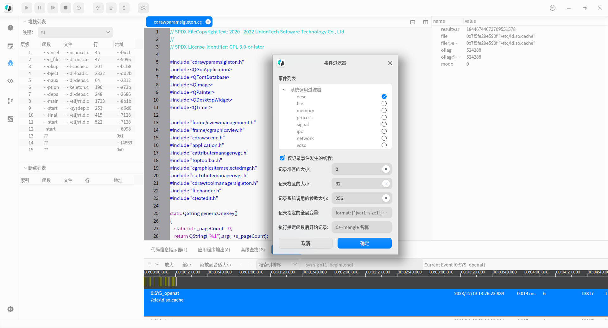
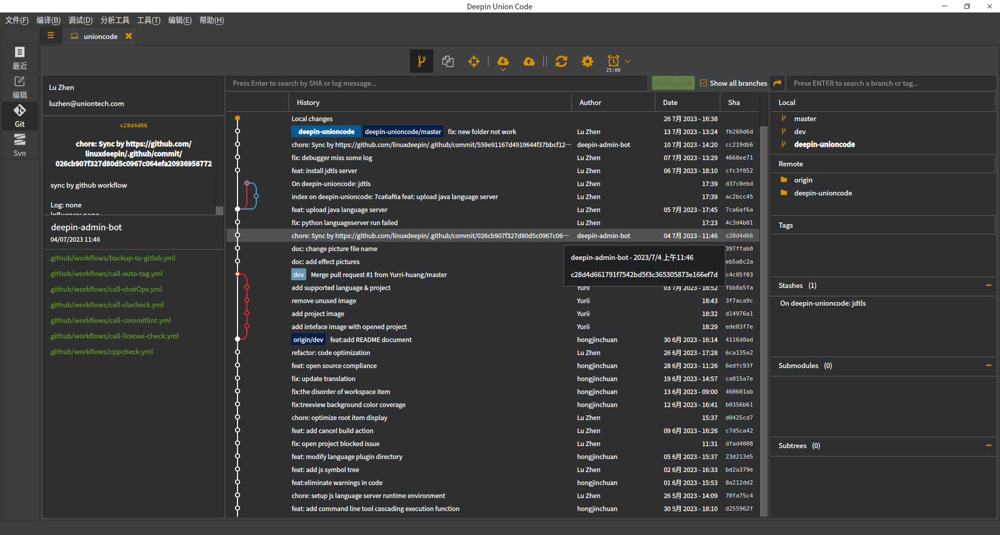

# deepin-unioncode

[](./README.md)

Deepin Union Code is a lightweight integrated development environment independently developed by Deepin Technology, featured with multilingual and cross platform compatibility.

## Build dependencies

_The **master** branch is current development branch, build dependencies may changes without update README.md, refer to `./debian/control` for a working build depends list_

- dh-systemd
- cmake
- qt5-qmake
- qtbase5-dev
- qttools5-dev
- qttools5-dev-tools
- lxqt-build-tools (>= 0.6.0~)
- libssl-dev
- llvm (>=1:7~)
- libclang-dev (>=1:7~)
- libutf8proc-dev
- libcurl-dev
- libmicrohttpd-dev
- libjsoncpp-dev
- libargtable2-dev
- libhiredis-dev
- catch
- libzstd-dev
- libjson-c-dev
- libelf-dev
- libcapstone-dev
- libunwind-dev
- libelfin-dev
- libdbus-1-dev
- libxi-dev
- qtscript5-dev
- libqt5scripttools5
- clang

Installation

## Build from source code

1. Make sure you have installed all dependencies.

``` shell
$ git clone https://github.com/linuxdeepin/deepin-unioncode.git
(gitee: $ git clone https://gitee.com/deepin-community/deepin-unioncode.git)
$ cd deepin-unioncode
$ sudo apt build-dep ./
```

2. Build:

```shell
$ cmake -B build -DCMAKE_INSTALL_PREFIX=/usr -DCMAKE_BUILD_TYPE=Release
$ cmake --build build
```

3. Install:

```shell
$ sudo cmake --build build --target install
```

The executable binary file could be found at `/usr/bin/deepin-unioncode`

## Usage

Execute `deepin-unioncode`

*Attention: After the installation of deepin-unicode, some features require the installation of dependency packages before they can be used normally.* 

## Supported Language Project

| Language   | Project Type      |
| ---------- | ----------------- |
| C/C++      | CMake             |
| Java       | Gradle、Maven     |
| Python     | Project Direcotry |
| JavaScript | Project Directory |

## Developed applications

| Application name    | Description                                         | Github Address                                               |
| ------------------- | --------------------------------------------------- | ------------------------------------------------------------ |
| deepin-draw         | A lightweight drawing tool for users to freely draw | https://github.com/linuxdeepin/deepin-draw<br />(https://gitee.com/deepin-community/deepin-draw.git) |
| deepin-image-viewer | Image viewing tool                                  | https://github.com/linuxdeepin/deepin-image-viewer<br />(https://gitee.com/deepin-community/deepin-image-viewer.git) |
| deepin-album        | A photo management tool                             | https://github.com/linuxdeepin/deepin-album<br />(https://gitee.com/deepin-community/deepin-album.git) |

## Getting help

 - [Official Forum](https://bbs.deepin.org/)
 - [User guide](https://wiki.deepin.org/zh/05_HOW-TO/02_%E5%BC%80%E5%8F%91%E7%9B%B8%E5%85%B3/deepin-unioncode)
 - [Developer Center](https://github.com/linuxdeepin/developer-center)
 - [Gitter](https://gitter.im/orgs/linuxdeepin/rooms)
 - [IRC Channel](https://webchat.freenode.net/?channels=deepin)
 - [Wiki](https://wiki.deepin.org/)

## Getting involved

We encourage you to report issues and contribute changes

 - [Contribution guide for developers](https://github.com/linuxdeepin/developer-center/wiki/Contribution-Guidelines-for-Developers-en) (English)
 - [开发者代码贡献指南](https://github.com/linuxdeepin/developer-center/wiki/Contribution-Guidelines-for-Developers) (中文)

## License

deepin-unioncode is licensed under [GPL-3.0-or-later](LICENSE)

## 3rdparty support

| Num  | Third-party Name | Version    | Reference method (dynamic, static, source code) | License     |
| ---- | ---------------- | ---------- | ----------------------------------------------- | ----------- |
| 1    | cppdap           | NA         | source code                                     | Apache 2.0  |
| 2    | googletest       | 1.11.0     | static                                          | BSD3        |
| 3    | nlohmann/json    | 3.10.4     | static                                          | MIT         |
| 4    | scintilla        | 5.15       | source code                                     | HPND        |
| 5    | lexilla          | 5.14       | source code                                     | HPND        |
| 6    | marl             | NA         | static                                          | Apache 2.0  |
| 7    | qtermwidget      | 0.14.1     | source code                                     | GPLV2+ BSD3 |
| 8    | GitQlient        | tag/v1.4.3 | source code                                     | GPLV-2.1+   |
| 9    | libclang/        | > 1:7~     | dynamic                                         | Apache  2.0 |
| 10   | llvm             | > 1:7~     | dynamic                                         | Apache  2.0 |
| 11   | json-rpc-cpp     | 1.4.1      | source code                                     | MIT         |


## Preview

- language support

  

- code porting

  

- debug mode

  
  
- reverse debug

  
  
- version management
