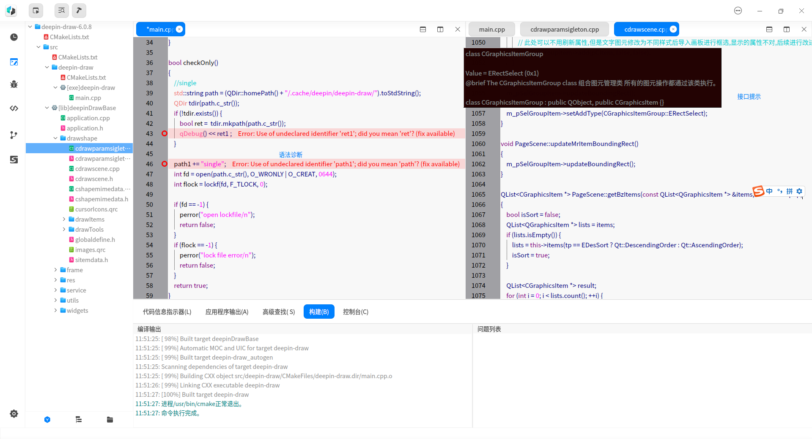
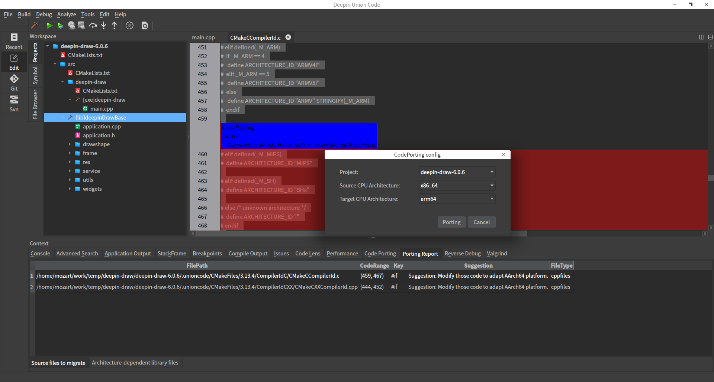
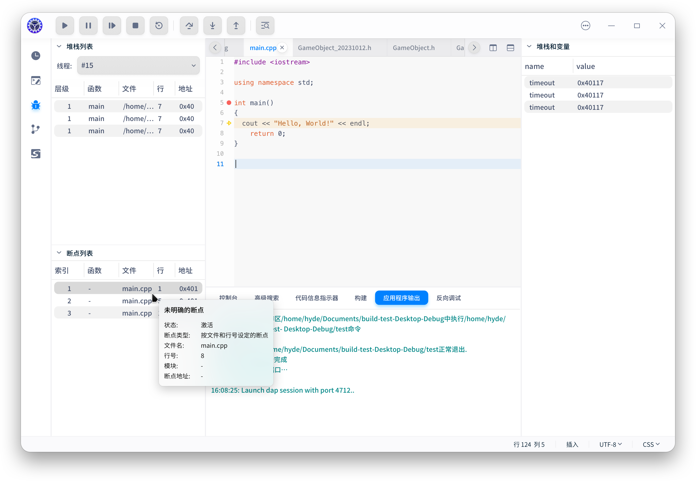
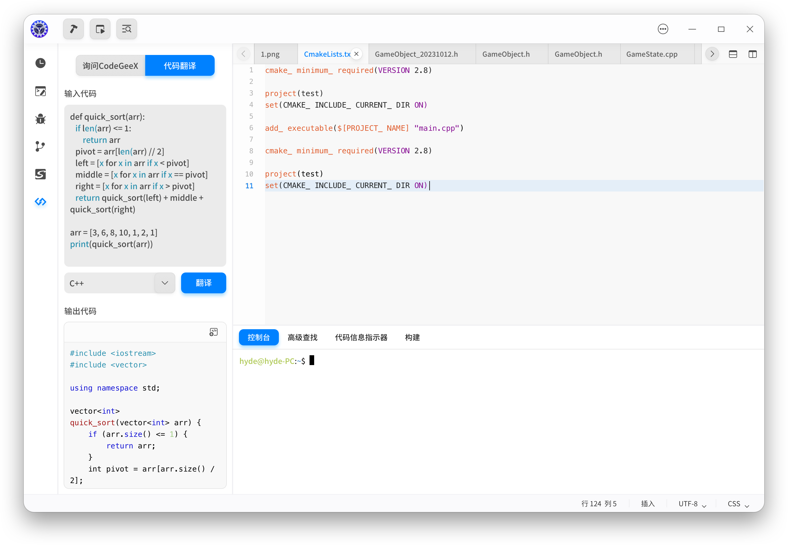
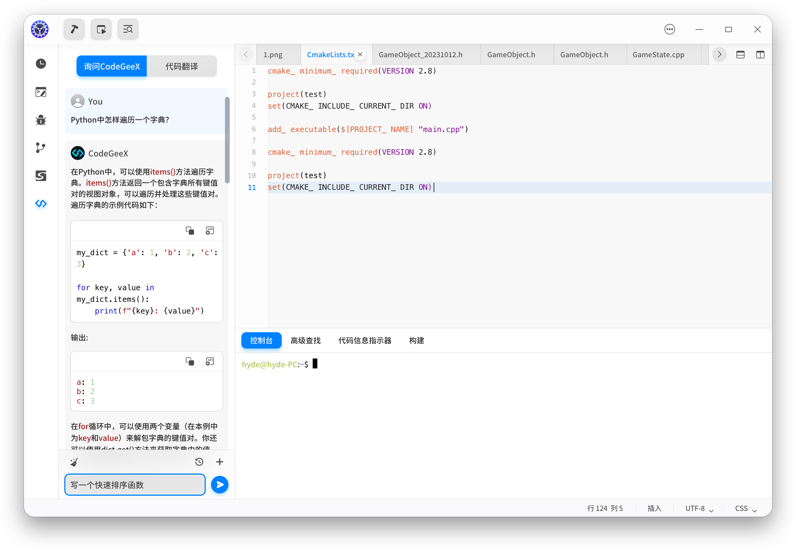

# deepin-unioncode

[](./README.en.md)

deepin-unioncode 是一款支持多语言、跨平台兼容特性的轻量级集成开发环境。

## 构建依赖

_当前的开发分支为**develop/main**，编译依赖可能会在没有更新本说明的情况下发生变化，请参考`./debian/control`以获取构建依赖项列表_

-  debhelper (>=9),
-  cmake,
-  qt5-qmake,
-  qtbase5-dev,
-  qttools5-dev,
-  qttools5-dev-tools,
-  lxqt-build-tools (>= 0.6.0~),
-  libssl-dev,
-  llvm (>=1:7~),
-  llvm-dev (>=1:7~),
-  libclang-dev (>=1:7~),
-  libutf8proc-dev,
-  libmicrohttpd-dev,
-  libjsoncpp-dev,
-  libargtable2-dev,
-  libhiredis-dev,
-  catch,
-  libzstd-dev,
-  libjson-c-dev,
-  libelf-dev,
-  libcapstone-dev,
-  libunwind-dev, 
-  libelfin-dev,
-  libdbus-1-dev,
-  libxi-dev,
-  qtscript5-dev,
-  libqt5scripttools5,
-  clang[!mips64],
-  doxygen,
-  libdtkgui-dev,
-  libdtkwidget-dev,
-  libdtkcore-dev,
-  libdtkcore5-bin,
-  libkf5syntaxhighlighting-dev

## 安装

​    *如若在Ubuntu上使用源码安装方式安装IDE，请先参考[DTK依赖安装](./docs/dtk-install-guide.md)，在DTK环境以及基本qt环境安装完成后，可通过下面源码安装的方式安装本IDE。*

1. 确保已经安装所有依赖库。


``` shell
$ git clone https://github.com/linuxdeepin/deepin-unioncode.git 
(gitee: $ git clone https://gitee.com/deepin-community/deepin-unioncode.git)
$ cd deepin-unioncode
$ sudo apt build-dep ./
```

2. 构建:

```shell
$ cmake -B build -DCMAKE_INSTALL_PREFIX=/usr -DCMAKE_BUILD_TYPE=Release
$ cmake --build build
```

3. 安装:

```shell
$ sudo cmake --build build --target install
```

可执行程序为 `/usr/bin/deepin-unioncode`

## 使用

启动栏执行 `deepin-unioncode`

*注意：deepin-unioncode安装后，部分功能需要安装依赖包后才能正常使用。*

## 支持的语言工程

| 语言       | 工程类型      |
| ---------- | ------------- |
| C/C++      | CMake         |
| Java       | Gradle、Maven |
| Python     | 工程目录      |
| JavaScript | 工程目录      |

## 开发应用列举

| 应用名              | 描述         | 仓库地址                                                     |
| ------------------- | ------------ | ------------------------------------------------------------ |
| deepin-draw         | 深度画板应用 | https://github.com/linuxdeepin/deepin-draw<br />(https://gitee.com/deepin-community/deepin-draw.git) |
| deepin-image-viewer | 深度看图应用 | https://github.com/linuxdeepin/deepin-image-viewer<br />(https://gitee.com/deepin-community/deepin-image-viewer.git) |
| deepin-album        | 深度相册应用 | https://github.com/linuxdeepin/deepin-album<br />(https://gitee.com/deepin-community/deepin-album.git) |

## 帮助

- [官方论坛](https://bbs.deepin.org/) 
- [用户使用手册](https://wiki.deepin.org/zh/05_HOW-TO/02_%E5%BC%80%E5%8F%91%E7%9B%B8%E5%85%B3/deepin-unioncode)
- [扩展指南](./docs/extended-guide.md)
- [开发者中心](https://github.com/linuxdeepin/developer-center) 
- [Gitter](https://gitter.im/orgs/linuxdeepin/rooms)
- [聊天室](https://webchat.freenode.net/?channels=deepin)
- [Wiki](https://wiki.deepin.org/)

## 贡献指南

我们鼓励您报告问题并做出更改

- [Contribution guide for developers](https://github.com/linuxdeepin/developer-center/wiki/Contribution-Guidelines-for-Developers-en) (English)
- [开发者代码贡献指南](https://github.com/linuxdeepin/developer-center/wiki/Contribution-Guidelines-for-Developers) (中文)

## 开源许可证

deepin-unioncode 在 [GPL-3.0-or-later](LICENSE)下发布。

## 三方库支持

| 三方库名称   | 版本号     | 应用位置              | 三方库协议类型 |
| ------------ | ---------- | --------------------- | -------------- |
| cppdap       | NA         | C++调试适配器协议 SDK | Apache 2.0     |
| QScintilla   | 2.14       | 智能编辑器界面组件    | GPLv3          |
| lexilla      | 5.14       | 智能编辑器词法分析库  | HPND           |
| qtermwidget  | 0.14.1     | 终端组件库            | GPLV2+ BSD3    |
| GitQlient    | tag/v1.4.3 | Git展示客户端         | LGPL-2.1+      |
| json-rpc-cpp | 1.4.1      | 通信中间件            | MIT            |
| DTK          | 5.6.8.9    | 界面显示              | LGPLv3+        |

## 界面预览

- 语言支持

  

- 代码迁移

  

- 调试模式

  

- 代码翻译

  

- AI 问答

  
