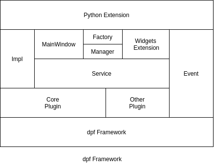
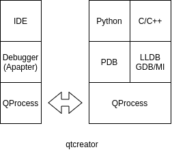
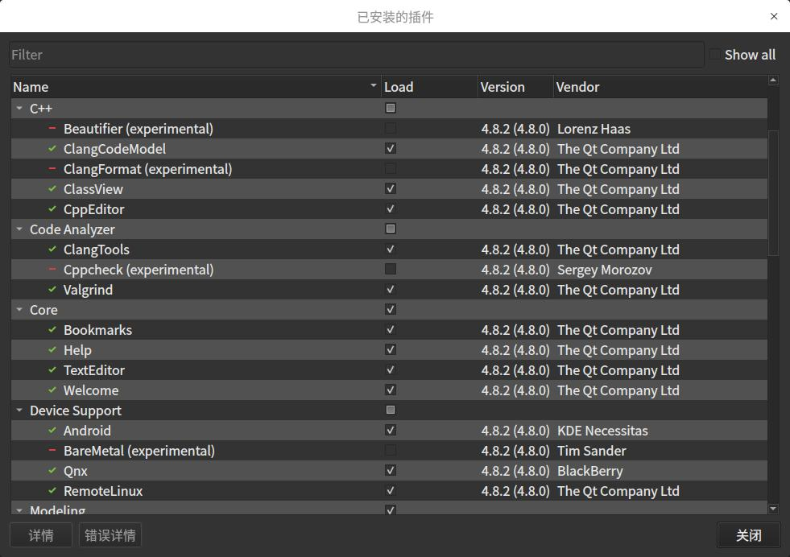
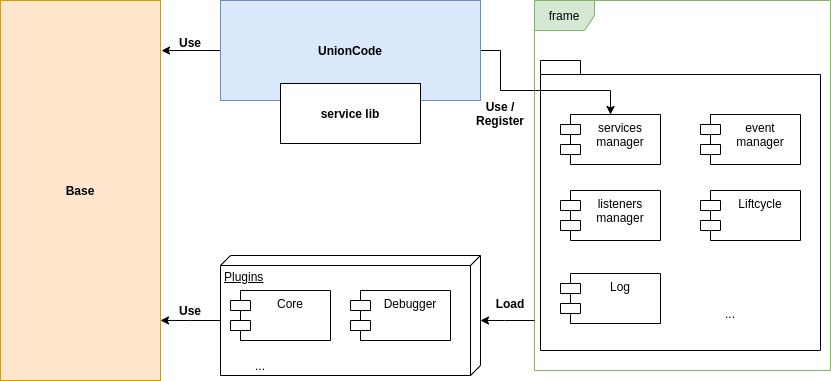
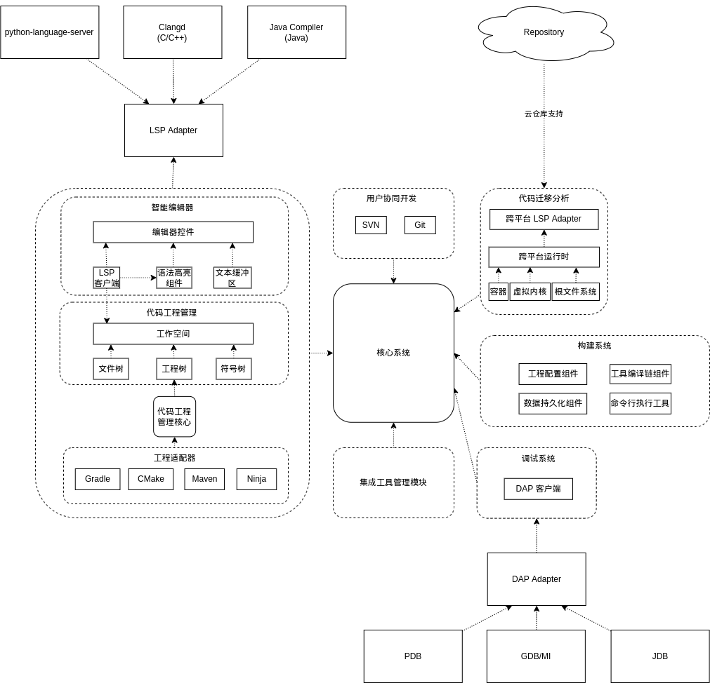

# `IDE`集成

## 插件框架

### `qtcreator`


### `dpf::Framework` 自研框架



 * 在`qtcreator`原有框架上开发，去除了复杂的动态`context`传递。
 * 服务从插件分离解耦，避免插件依赖，提高可维护性。
 * 提供基于框架`Event`和扩展。
 * 支持模板注册，和动态构造。提高程序启动性能。

| 框架名称      | 懒加载 | 支持动态扩展 | 插件可维护性 | 语言扩展性|
| ---------------- | ------------------ | ------------ | ------------ | ------------ |
| `qtcreator` | 无                 | 是 |插件耦合，可维护性低。|Qt框架影响|
| `dpf::Framework` | 支持              | 是 |插件非耦合，可维护性高。|Qt框架影响|


## Code Debug

### `qtcreator`



​	`qtcreator` 内部使用 `QProcess` 进行 `Debug` 程序启动，通过标准 `StdIO` 进行 `Debug` 信息交互。

### `DAP`

**`DAP`主要结构**


**`DAP`通信交互时序**

通过`DAP`协议进行前端`LSP`后端适配`Adapter`，即可实现。通信内部采用`Json-RPC`，主要访问流程如下：


我们假设用户已经启动了一个调试会话，但当前在他们程序的入口点停止并想要设置（然后点击）一个断点。

- 用户通过在断点槽中单击来在特定源文件中设置一个或多个断点。开发工具向`setBreakpoints`调试适配器发送请求，调试适配器向 `gdb` 调试器注册断点。
- 然后用户按下**继续**按钮以恢复执行。该工具向`continue`调试适配器发送请求，调试适配器将其转换为相应的 `gdb` 命令。
- 一段时间后，断点被击中，调试适配器从 `gdb` 接收一些通知并将其转换为`stopped`发送到开发工具的 `DAP`事件。
- 为响应此`stopped`事件，开发工具更新其 `UI` 并显示堆栈跟踪视图。这会触发一个`stacktrace`请求，该请求返回为各个堆栈帧显示的所有信息。
- 如果用户选择一个堆栈帧，则开发工具通过请求请求该帧的变量`variables`。

**`DAP`协议内容参考**

[`DAP`协议规范](https://microsoft.github.io/debug-adapter-protocol/specification)

| 方案 |技术类型| Java后端支持 | C++后端支持|Python后端支持|
| ---- |---- | ------------ | ------------ |------------ |
| `qtcreator`| `StdIO` | 不支持 |支持 | 支持           |
|`DAP`|`RPC`|支持|支持|支持|

推荐`DAP`方式作为 `Code Debug` 的方案选择。

## 代码工程管理


* 工程文件`Adapetr` 在处理后原有配置文件后生成节点模型，对应生成文件树数据。

* 文件节点模型中可触发显示原工程文件，显示到智能编辑器。智能编辑器通过后端语法正则进行高亮等显示。
* 在文件树组件加载数据时可同步进行构建系统初始化，并初始化相关的编译工具链。

## 集成工具管理

### `Apapter` 适配



* 与界面交互逻辑紧密可采用该方式。取决于 `IDE` 实现的方式，如果采用原生C++与Qt，那么便支持原生C++与Qt的扩展。没有进程隔离的特性。
* 在自研 `dpf::Framework` 框架下进行脚本语言扩展，例如 `Python` 。其面向插件的编程语言扩展得到增强，更贴近社区开发者。 

### `LauchApp`分离调用


* 通过脚本扩展可集成至 `IDE` 固定菜单项，界面入口与 `UI` 设计相关。
* 关于已集成的工具可通过热键或者固定的 `search` 工具进行唤醒。
* 该集成方式对 `IDE` 的效率要求影响较小。且兼容其他应用程序的兼容性高。

### `Terminal` 终端集成


* 可实现本地非集成`IDE`的工具入口进行交互。

* 在 `Terminal` 下，可以直接进行虚拟环境的操作，在本地跨平台编译不够完善时，应对本地部署交叉编译特定需求。
* 用户行为通常是软件设计不可预估，提供应对更为贴近用户所运行环境的入口。

## 用户协同开发


**原生接口集成 **

* `IDE` 原生提供 `Adapter` 接入方式，通过动态库插件或者在此之上的其他脚本语言扩展。
* 通过适配器进行版本管理工具接入，最终体现在 `IDE` 的界面代码分支管理。
* 对于不同的代码管理工具，可存在代码管理模块上操作的异同，可取决于代码管理 `Adapter` 如何适配操作。例如右键菜单中 `Action` 点击触发的操作逻辑。
* 代码管理操作模块通过触发逻辑，可将文件展示或者进行界面逻辑调用。

**扩展集成**

* 由集成管理工具进行适配，例如 `git` 管理工具`GitKraken` 。可通过 `LauchApp` 的方式集成。

* 其他未知版本管理，可由 `Terminal` 作为入口，进行兼容。


## 自研框架基本概念



## 核心架构



​	为契合框架细化模块变更为如下：


## 源码文件树结构

```base
unioncode/
├── 3rdparty				//第三方源码集成库
├── debian					//debian构建目录
├── src						//工程源码目录
│   ├── app  				//执行程序目录
│   ├── base   				//IDE基础库，封装扩展适配抽象类
|	├── common				//IDE通用库，封装复用的操作函数类
│   ├── framework   		//插件框架
│   ├── plugins   			//IDE插件
│   │   ├── builder  		//构建插件，本地与交叉编译
│   │   ├── collaborators   //协作者插件，代码协同，版本管理
│   │   ├── core			//核心插件，背板服务
│   │   ├── debugger		//调试器插件
│   │   ├── codeeditor		//智能编辑器插件
│   │   ├── console			//集成终端插件
│   │   ├── filebrowser		//文件浏览插件（文件树）
│   │   ├── runtime			//运行时插件
│   │   ├── codeedit		//智能编辑器插件，文件树，代码编辑器
│   ├── resource			//资源文件目录
│   ├── services			//插件服务目录，适配器
│   │   ├── debugger		//调试服务
│   │   └── window			//窗口服务
│   └── tools				//自封装工具
└── tests					//单元测试目录
```

# 安装文件目录结构

```base
/usr/bin								// 执行程序安装路径
/usr/lib/unioncode/		    			// 依赖库路径，包含自研库和源码集成第三方库路径
/usr/lib/unioncode/plugins  			// 动态库插件安装路径
/usr/lib/unioncode/tools				// 二进制文件工具
/usr/lib/unioncode/extensions			// 动态语言扩展插件路径
/usr/share/unioncode					// 资源文件路径
/usr/share/unioncode/configures			// 全局配置文件路径
/usr/share/unioncode/scripts			// 脚本文件安装路径
/usr/share/unioncode/translations		// 翻译文件安装路径
/usr/share/unioncode/template			// 文件模板目录，创建Class或者CMake等

~.config/unioncode/configure			// 用户配置文件路径
~.cache/unioncode						// 用户使用数据缓存路径，例如打开的历史文件等
~.unioncode								// 扩展支持路径
~.unioncode/plugins						// 动态库插件调试加载路径
~.unioncode/extensions 					// 动态语言扩展插件加载路径
```


## 技术细节

### 插件实例

最终的业务闭包。目前插件包含

* 核心插件 `core` ，窗口构造，窗口扩展支持，包含子模块如下
  * 窗口管理模块，提供窗口扩展，导航栏，顶部菜单扩展等。
  * 窗口切换模块，本质为框架事件响应模块，可通过事件驱动内部逻辑，达到窗口各个组件的切换。
  * 窗口主题模块，使用 `qss` 文件进行主题风格设置。
* 智能编辑器插件 `codeedit` ，提供代码编辑界面支持，包含子模块如下
  * 文件树，提供本地文件树操作。
    * 右键菜单：删除文件/文件夹、新增文件、移动到回收站、删除文件、构建触发入口。
  * 文件编辑组件：集成第三方库 `qscintilla` 。
  * 过程输出组件：构建触发时进行过程信息展示。
  * 环境交互窗口：`console` 交互。
  * 其他窗口扩展支持，例如debug界面排布支持。
* 调试插件 `debuger` 
  * 本地调试界面，变量栈信息、自定义监听关键字。
  * 远程调试界面，发布主机。远程 `ssh` 服务。
* 构建插件 `builder` 集成后端响应接口
  * 构建配置界面，即工具链选择与配置界面。
  * 本地环境支持，通过 `QProcess`的方式进行程序或者脚本调用，输出结果通过本地通信方式进行过程数据转发
  * 交叉编译支持，与本地环境支持保持一致
* 代码协同插件 `collaborators` 
  * 暂无相关设计
### 框架服务

从插件中分离的动态库，目的在于解耦合。

目前框架服务只存在1个实体，表达形式为动态库，名称为 `unioncode-service`。

- window：窗口服务，可由多个插件发布的注册入口。目前 `core`、`codeedit` 插件添加了相关服务支持

### 框架事件

如果插件与插件间需要通信则需要用到框架事件。

框架自带的事件机制，支持同步与异步。采用消息订阅的方式进行发送者接收者的组合。

目前 `Core` 插件内实现了窗口切换的窗口事件支持。支持任意发送者所发布的事件信息进行过程驱动。

### 工程管理构建
工程管理与构建包含多个方面，具体如下：

- 工程解析：即 `CMakeList.txt` 或者 `Makefile`或者其他具有标志性的文件后缀，例如 `.pro`，不做工程项解析与配置。与`Vs code`打开文件夹的方式一致作为工程管理。

- 工程构建：右键菜单与选择构建进行界面前端与构建子系统参数传递，通过管道方式进行数据交互。其产生的配置信息如工具链等，通过 `json` 文件进行保存

- 工程用户行为：针对不同工程可进行自定义风格配置，存储到文件夹顶层隐藏文件夹 `.unioncode/` 下，所有插件事件响应时，通过读取该文件夹下是否存在文件与文件内容进行工程用户行为初始化。现有统计项如下：
  - scintilla 用户输入关键字缓存数据库
  - 代码分析工具初始化配置文件
  - 配置的环境变量文件
  - 远程调试配置文件