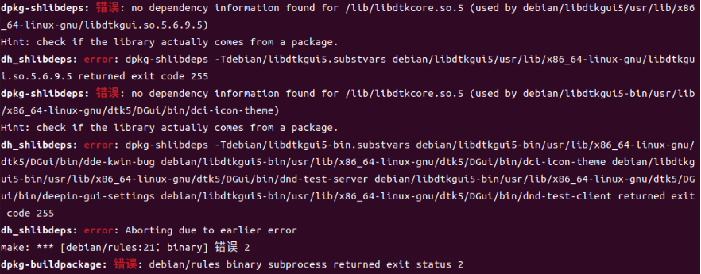

## DTK依赖安装

对于Deepin-IDE，所需要的依赖库包括dtkcore，dtkwidget，dtkgui以及qt5integration，本部分介绍这几个依赖的安装。

### 1. 源码拉取

首先需要在深度的github社区中下载dtk依赖库的源码：

[dtkcore](https://github.com/linuxdeepin/dtkcore)，[dtkwidget](https://github.com/linuxdeepin/dtkwidget)，[dtkgui](https://github.com/linuxdeepin/dtkgui)，[qt5integration](https://github.com/linuxdeepin/qt5integration)

其中，dtkcore可能会依赖[dtkcommon](https://github.com/linuxdeepin/dtkcommon)，qt5integration会依赖[qt5platform-plugins](https://github.com/linuxdeepin/qt5platform-plugins)

### 2. 环境安装

首先需要安装qt环境，按照以下命令执行

```shell
sudo apt update
sudo apt install qtbase5-dev qtchooser qt5-qmake qtbase5-dev-tools qttools5-dev qt5-private-dev
```

### 3. 安装

源码拉下来之后，确保所需依赖都已正确安装，在每个依赖库的源码所在的目录位置执行以下命令

```shell
sudo apt build-dep .
```

接下来有两种方式来安装dtk依赖，一种是源码安装方式，第二种是自己构建软件包安装方式。源码安装方式在对应的各自依赖库的README文档中有介绍，这里不再赘述。这里介绍使用软件包安装方式：

在各自依赖库的源码根目录下，使用以下命令打包

```shell
dpkg-buildpackage -us -uc -b -j16
```

-j16为多核执行，可根据处理器核数和性能酌情增减。

安装依赖库时可能会出现以下错误：



原因：依赖的版本问题导致无法正常打包

解决方法：

```shell
vim debian/rules
# 在打开的文件中找到override_dh_shlibdeps:
# 添加dh_shlibdeps --dpkg-shlibdeps-params=--ignore-missing-info
```


在所有依赖都成功打包后，可直接使用安装包进行依赖的安装，安装完成后使用命令查看依赖是否安装成功，以及依赖的版本是否满足要求。

```shell
apt policy libdtkcore5
# 其他依赖同理
```
