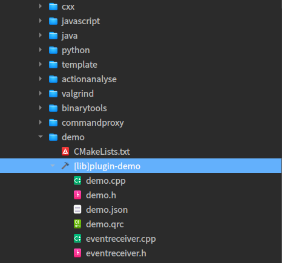
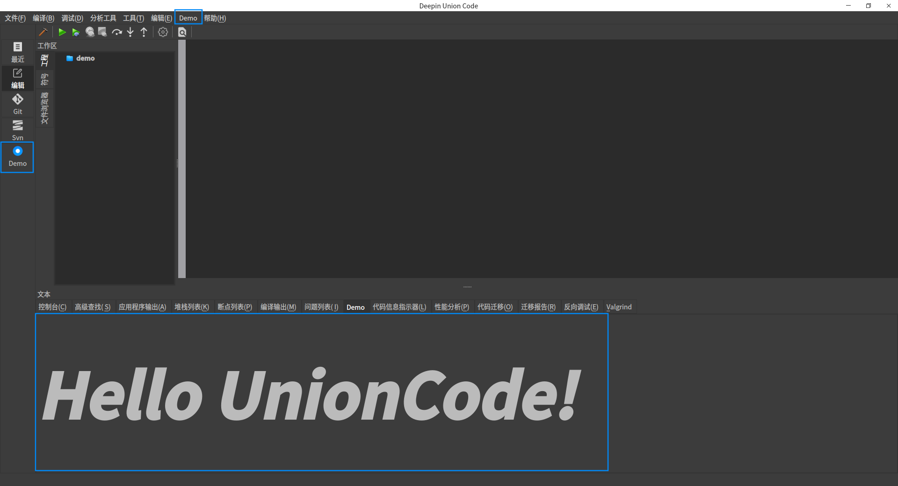

# deepin-unioncode 扩展指南

## 一、扩展能力支持

| 能力             | 描述                                                         | 是否支持           |
| ---------------- | ------------------------------------------------------------ | ------------------ |
| 插件扩展         | 按照规范编写插件，安装到指定位置后可以识别加载，目前仅支持C++插件 | 支持               |
| 界面元素扩展     | 调用对应接口，可以在 IDE 的导航栏、菜单栏、工具栏、底部窗口、右侧窗口插入自定义界面 | 支持               |
| 编程语言扩展     | 支持新的编程语言接入，实现编译、调试等功能                   | 支持               |
| 工程信息获取     | 可以获取工程的目录、类型、参数等                             | 支持               |
| 自定义调试器接入 | 支持接入除 DAP 调试器以外的自定义调试器                      | 支持               |
| 编辑器交互能力   | 发布编辑器的各种事件，比如悬停、补全等，并提供编辑的各类接口，如插入、获取、统计等 | 计划在下一版本支持 |
| 模板扩展         | 支持导入外部工程模板，并支持创建新的引导界面                 | 支持               |


## 二、插件扩展规范

### 1、插件模板

这里以 deepin-unioncode 自带的插件模板作为示例进行说明。

技术栈：**C/C++、Qt（5.11.3）、dpf(插件框架)**

- 创建

  打开菜单**文件** > **新建文件或工程** > **Projects** > **plugin**，填入工程名和存放路径，完成模板的创建。存放路径建议设置为 deepin-unioncode 源码的 src/plugins 目录，并在该目录下的 cmake 文件中添加模板工程。完成上述步骤后，新建的插件模板就显示到 IDE 的工程视图中。

  

- CMakeLists.txt 文件


```cmake
...
target_link_libraries(${PROJECT_NAME}
    framework # 插件框架
    base # 基础类
    services # 服务
    common # 通用功能
    ${QtUseModules}
    ${PkgUserModules}
    )
    
# PLUGIN_INSTALL_PATH = /usr/lib/$Arch(x86_64-linux-gnu)/deepin-unioncode/plugins
install(TARGETS ${PROJECT_NAME} LIBRARY DESTINATION ${PLUGIN_INSTALL_PATH}
```

一般而言，上面几个库都需要链接，最后一行是将该插件安装到指定位置，才能被 `IDE` 发现调用。

- 元数据文件

还有一个条件是包含元数据，也就是上面的 demo.json，该文件需要包含到工程内，内容如下：

```json
{
    "Name" : "plugin-demo", // 插件名
    "Version" : "4.8.2",  // 插件版本
    "CompatVersion" : "4.8.0", // 兼容版本
    "Vendor" : "XXX Co., Ltd.", // 提供商
    "Copyright" : "Copyright (C) 2020 ~ 2022 XXX Co., Ltd.", // 版权声明
    "License" : [
        "XXX" // License声明
    ],
    "Category" : "XXX",  // 分组策略
    "Description" : "XXX.",  // 描述
    "UrlLink" : "XXX",  // 网页链接
    "Depends" : [
        {"Name" : "plugin-codeeditor"}  // 插件依赖，
    ]
}
```

完成上述操作后，进行编译安装，一个 `IDE` 插件的接入就已经完成。

可以在菜单栏**帮助** > **关于插件...** 查看是否被正确加载。


此时，可以在导航栏、菜单栏、底部窗口看到 Demo 控件：



### 2、功能接口

[插件模板](#插件模板)讲述了如何接入一个 `IDE` 插件，本章将介绍如何在插件中调用 `IDE` 的能力，实现界面嵌入、菜单接入等常用功能。

#### 2.1、services	

services 是 IDE 提供的服务接口，该接口是通过动态绑定的形式实现，所以不存在插件依赖的问题。目前主要的服务接口包含为4个，分别是窗口服务、工程服务、选项服务和语言服务。	

| 接口类型        | 描述                                                         |
| --------------- | ------------------------------------------------------------ |
| WindowService   | 窗口服务，用于嵌入插件界面到指定位置                         |
| ProjectService  | 工程服务，可以获取工程相关的信息，比如工程目录、工程类型等   |
| OptionService   | 选项服务，用于实现插件参数的统一配置，也就是 IDE 中的选项面板 |
| LanguageService | 语言服务，调用该服务实现新语言的接入，如果有特殊的编译流程请结合 BuilderService 和 DebuggerService 使用。注意，新语言的接入往往还需要添加对应的 LSP 和 DAP 后端。 |

以下针对每个服务进行说明：

- WindowService	

| 函数名                  | 参数                                                         | 描述                                     |
| ----------------------- | ------------------------------------------------------------ | ---------------------------------------- |
| addActionNavigation     | const QString &id, AbstractAction \*action                   | 添加导航栏action                         |
| addMenu                 | AbstractMenu \*menu                                          | 添加菜单项                               |
| addAction               | const QString &menuName, AbstractAction \*action             | 添加Action到其他由框架发布的可扩展menu   |
| removeActions           | const QString &menuName                                      | 移除框架扩展menu中的Action               |
| insertAction            | const QString &menuName, const QString &beforeActionName, AbstractAction \*action | 在指定Action之前插入Action到框架扩展menu |
| addCentralNavigation    | const QString &name, AbstractCentral \*central               | 添加中心显示组件                         |
| addWidgetWorkspace      | const QString &title, AbstractWidget \*widget                | 添加左侧工作空间组件                     |
| setWidgetConsole        | AbstractConsole \*console                                    | 设置默认终端                             |
| setWidgetEdit           | AbstractCentral \*widget                                     | 设置编辑器组件                           |
| addContextWidget        | const QString &contextTab, AbstractWidget \*contextWidget, const QString &group | 添加交互组件                             |
| removeContextWidget     | AbstractWidget \*contextWidget                               | 移除交互组件                             |
| setStatusBar            | AbstractWidget \*statusBar                                   | 设置状态栏                               |
| addWidgetToStatusBar    | QWidget \*widget                                             | 将组件添加到状态栏                       |
| insertWidgetToStatusBar | int index, QWidget \*widget                                  | 在指定位置插入组件到状态栏               |
| setWidgetWatch          | AbstractWidget \*widget                                      | 设置监视器组件                           |
| addOpenProjectAction    | const QString &name, AbstractAction \*action                 | 添加打开工程的Action                     |
| addFindToolBar          | AbstractWidget \*widget                                      | 添加查找工具栏                           |
| showFindToolBar         | 无参数                                                       | 显示查找工具栏                           |
| addToolBarActionItem    | const QString &id, QAction \*action, const QString &group    | 添加工具栏动作项                         |
| addToolBarWidgetItem    | const QString &id, AbstractWidget \*widget, const QString &group | 添加工具栏组件项                         |
| addToolBarSeparator     | const QString &group                                         | 添加工具栏分隔符                         |
| removeToolBarItem       | const QString &id                                            | 移除工具栏项                             |
| setToolBarItemDisable   | const QString &id, bool disable                              | 设置工具栏项是否禁用                     |
| showMessageDisplay      | 无参数                                                       | 展示处理消息提示框                       |
| appendProcessMessage    | const QString &mess, int currentPercent, int maxPrecent = 100 | 添加处理消息                             |
| hideMessageDisplay      | 无参数                                                       | 隐藏处理消息提示框                       |

- ProjectService

| 函数名               | 参数                                             | 描述                                   |
| -------------------- | ------------------------------------------------ | -------------------------------------- |
| name                 | 无                                               | 返回服务的名称。                       |
| supportGeneratorName | 无                                               | 返回支持的生成器名称的 QStringList。   |
| implGenerator        | const QString &name, QString *errorString        | 导入具有给定名称的生成器对象。         |
| createGenerator      | const QString &name, QString *errorString        | 创建具有给定名称的生成器对象。         |
| name                 | T* value                                         | 返回与给定值相关联的名称。             |
| values               | 无                                               | 返回值的 QList。                       |
| getAllProjectInfo    | 无                                               | 检索所有项目信息的列表。               |
| getProjectInfo       | const QString &kitName, const QString &workspace | 检索指定工具包名称和工作区的项目信息。 |
| getActiveProjectInfo | 无                                               | 检索活动项目的项目信息。               |
| getActiveTarget      | TargetType                                       | 检索指定类型的活动目标。               |
| projectConfigureDone | const QString &buildDirectory                    | 表示项目配置已完成，并提供指定目录。   |

- OptionService

服务接口用于注册OptionGenerator的子类，在子类主要提供当前配置页面的套件名和对应的配置界面。

| 函数名       | 参数 | 描述                                     |
| ------------ | ---- | ---------------------------------------- |
| kitName      | 无   | 当前配置页面的套件名，比如CMake、Ninja等 |
| optionWidget | 无   | 返回插件自定义的配置界面                 |


- LanguageService

​	通过接口 regClass 注册语言生成器，调用 create 创建语言实例。插件要做的工作是继承 `LanguageGenerator` 实现自有逻辑。

| 函数名               | 参数                                                         | 描述                                                         |
| -------------------- | ------------------------------------------------------------ | ------------------------------------------------------------ |
| isNeedBuild          | 无                                                           | 返回生成器是否需要构建。                                     |
| isTargetReady        | 无                                                           | 返回目标是否准备就绪。                                       |
| isAnsyPrepareDebug   | 无                                                           | 返回调试准备是否是异步的。                                   |
| debugger             | 无                                                           | 返回要使用的调试器。                                         |
| prepareDebug         | const QMap<QString, QVariant> &param, QString &retMsg        | 使用给定的参数准备调试。                                     |
| requestDAPPort       | const QString &uuid, const QMap<QString, QVariant> &param, QString &retMsg | 使用给定的UUID和参数请求DAP端口。                            |
| isLaunchNotAttach    | 无                                                           | 返回是否启动而不是附加。                                     |
| launchDAP            | const QMap<QString, QVariant> &param                         | 使用给定的参数启动DAP，并返回一个 dap::LaunchRequest 对象。  |
| attachDAP            | int port, const QMap<QString, QVariant> &param               | 使用指定的参数将DAP附加到给定的端口，并返回一个 dap::AttachRequest 对象。 |
| isRestartDAPManually | 无                                                           | 返回是否需要手动重新启动DAP。                                |
| isStopDAPManually    | 无                                                           | 返回是否需要手动停止DAP。                                    |
| build                | const QString& projectPath                                   | 构建位于给定路径的项目，并返回一个字符串。                   |
| getProjectFile       | const QString& projectPath                                   | 返回给定项目路径的项目文件。                                 |
| getDebugArguments    | const dpfservice::ProjectInfo &projectInfo, const QString ¤tFile | 返回给定项目信息和当前文件的调试参数，以 QMap<QString，QVariant> 的形式。 |
| getRunArguments      | const dpfservice::ProjectInfo &projectInfo, const QString ¤tFile | 返回给定项目信息和当前文件的运行参数，以 RunCommandInfo 对象的形式。 |

#### 2.2、事件接口

待补充。

#### 2.3、通用接口

| 接口名        | 位置                                 | 描述                                                         |
| ------------- | ------------------------------------ | ------------------------------------------------------------ |
| ActionManager | common/actionmanager/actionmanager.h | 用于注册菜单项                                               |
| widget        | common/widget/*                      | 各类通用控件，比如折叠控件、输出面板等，插件可以基于这些控件进行自定义修改 |
| util          | common/util/*                        | 工具类，比如获取安装路径、配置路径等；获取环境变量；下载工具等 |


## 三、模板工程添加规则

`IDE` 提供快速创建模板的能力，目前已支持三方扩展。扩展方式较为简单，修改两个配置文件然后将模板工程放置到指定位置即可实现。

### 1、配置文件

**1、templates.json** 用于添加模板的类型和指定模板的位置

**2、wizard.json** 用于配置模板工程的详细信息

### 2、创建步骤

#### 2.1、模板参数配置

将模板工程放到 asserts/templates 的 projects 目录下，并修改 asserts/templates 下面的 templates.json 文件。

##### 2.1.1、工程模板

添加如下的配置项：

```
   {
       "type": "CMake",
       "templates": [{
           "name": "console",
           "path": "projects/cmake/console",
           "leafNode": true
       }]
   }
```

其中，type 代表工程类型，templates 是该类型下的示例工程，每个示例工程有三个属性：

- name：用字符串表示该工程的名称
- path：表示该工程相对于 templates.json 的路径；
- leafNode：表示是否是子节点。

##### 2.2.2、文件模板

示例配置：

```json
   {
       "Projects": [{
           "type": "CMake",
           "templates": [{
               "name": "console",
               "path": "projects/cmake/console",
               "leafNode": true
           }]
       }],
       "Files": [{
           "type": "C++",
           "templates": [{
               "name": "header file",
               "path": "files/c++/header",
               "leafNode": true
           },
           {
               "name": "source file",
               "path": "files/c++/source",
               "leafNode": true
           }]
       }]
   }
```

其中，type 代表文件类型，templates 是该类型下的示例文件，文件可以有多个，比如源文件和头文件，其它属性和工程模板中的属性类似。

#### 2.2、向导参数配置

创建向导的配置方法是在 assets/templates/projects/your_project_type下创建一个 wizard.json 文件。本节以 CMake 类型的 console 工程为例进行说明。

首先在 projects/CMake/console 下创建一个 wizard.json 文件。其中 CMake 就是工程类型，console 是工程细分类型。

示例配置：

```json
   {
       "type": "project",
       "kit": "cmake",
       "language": "C/C++",
       "trDisplayName": "CMake Console Application",
       "trDescription": "An application with cmake console",
       "configures": [{
           "key": "ProjectName",
           "displayName": "Project Name",
           "type": "lineEdit",
           "defaultValues": [],
           "browse": false
       },
       {
           "key": "Location",
           "displayName": "Location",
           "type": "lineEdit",
           "defaultValues": [],
           "browse": true
       }],
       "generator": {
           "rootFolder": "%{ProjectName}",
           "destPath": "%{Location}",
           "operations": [{
               "sourceFile": "CMakeLists.txt",
               "replaceKeys": ["%{ProjectName}"]
           },
           {
               "sourceFile": "main.cpp",
               "replaceKeys": []
           }]
       }
   }
```

其中每个字段的说明如下：

- type：指定该模板类型，可选项有 project 和 file
- kit：指定该工程属于哪一类别的工程，可选项有 CMake、Maven、Gradle、Python、Ninja
- language：指定该工程使用的编程语言，可选项有 C/C++、Java、Python
- trDisplayName：指定该工程的全称
- trDescription：指定该工程的描述信息
- configures：是一个数组，指定该工程创建时需要指定的一些属性，每组属性包含以下字段
  - key 表示该字段的含义
  - displayName 表示该属性在 UI 上的显示名称
  - type 表示该属性值的输入控件类型，可选项有 lineEdit 和 comboBox
  - defaultValues 表示输入控件中填入的默认值，为一个数组，主要用于 comboBox 的下拉列表选项
  - browse 表示是否有文件路径选择的浏览按钮
- generator 指定工程生成的规则。用于指定工程根目录名称、生成目标位置、对文件做的替换操作，该项中的值与 configures 中输入的值对应，加上%{}符号以示区分。
  -  rootFolder指定生成工程的根目录名称；
  - destPath指定生成工程的目标绝对路径；
  - operations是一个数组，它将指定在原工程模板中哪些文件替换掉哪些字段，每组数据包含sourceFile用于指定文件（相对根目录的文件位置），replaceKeys用于指定要替换的字段。

### 3、最终效果

启动 deepin-unioncode，点击“文件”>"新建文件或工程">"弹出模板创建页面"：


