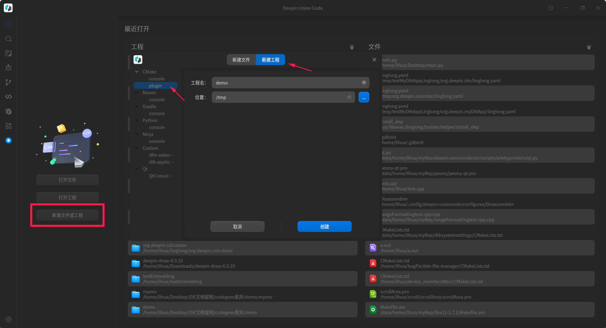
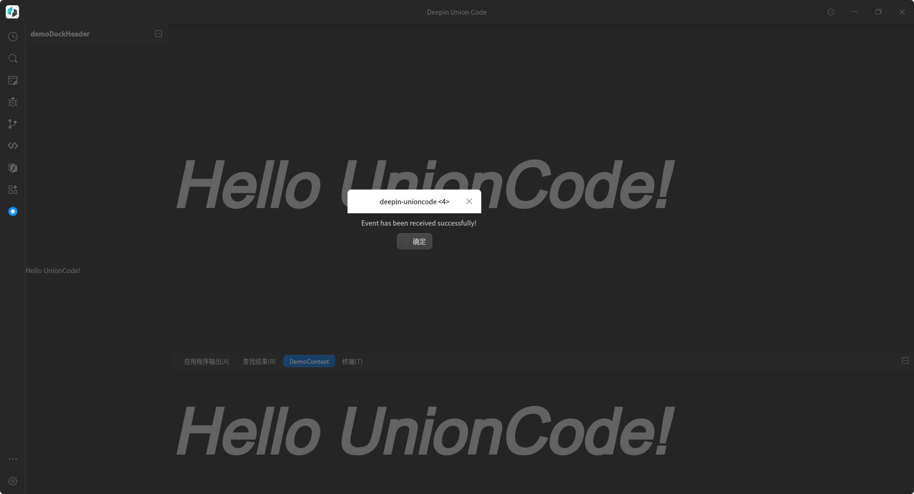
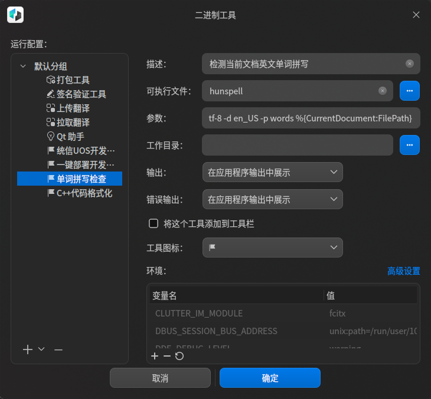
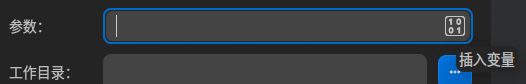
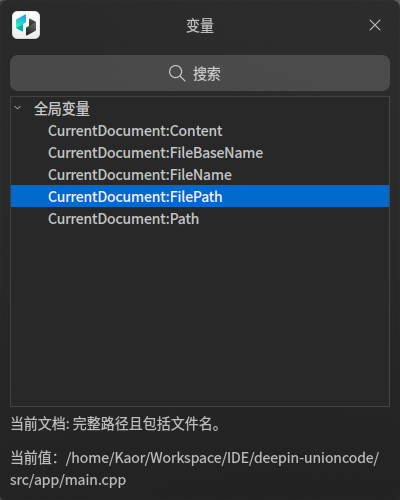
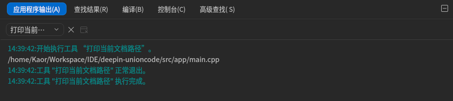
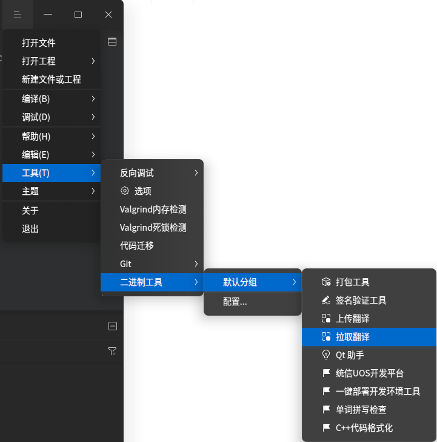
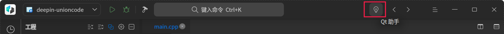

# deepin-unioncode 扩展指南

## 一、扩展能力支持

对应的 deepin-unioncode 版本：**1.3.12**

在线文档：https://github.com/linuxdeepin/deepin-unioncode/blob/master/docs/extended-guide.md

| 能力             | 描述                                                         | 是否支持 |
| ---------------- | ------------------------------------------------------------ | -------- |
| 插件扩展         | 按照规范编写插件，安装到指定位置后可以识别加载，目前仅支持C++插件 | 支持     |
| 界面元素扩展     | 调用对应接口，可以在 IDE 的导航栏、菜单栏、工具栏、底部窗口、右侧窗口插入自定义界面 | 支持     |
| 编程语言扩展     | 支持新的编程语言接入，实现编译、调试等功能                   | 支持     |
| 工程信息获取     | 可以获取工程的目录、类型、参数等                             | 支持     |
| 自定义调试器接入 | 支持接入除 DAP 调试器以外的自定义调试器                      | 支持     |
| 编辑器交互能力   | 发布编辑器的各种事件，比如悬停、补全等，并提供编辑的各类接口，如插入、获取、统计等 | 支持     |
| 模板扩展         | 支持导入外部工程模板，并支持创建新的引导界面                 | 支持     |


## 二、插件扩展规范

### 1、插件模板

这里以 deepin-unioncode 自带的插件模板作为示例进行说明。

技术栈：**C/C++、Qt（5.11.3）、dpf(插件框架)**

使用该插件模板有两种方式：

1. （**推荐**）在任意目录创建，按照模板中用法，开发自己的插件。进行编译，将编译后得到的动态库文件放入`/usr/lib/${CMAKE_LIBRARY_ARCHITECTURE}/deepin-unioncode/plugins`中。 

2. 将插件模板放在`deepin-unioncode`源码目录下，通过编译运行`deepin-unioncode`来开发和调试插件。

   其中第二种方式更加适合在开发过程中需要进一步进行调试的开发者。

- 创建

  打开菜单**文件** > **新建文件或工程** > **新建工程** >**CMake** >**plugin**，填入工程名和存放路径，完成模板的创建。

  

- CMakeLists.txt 文件


```cmake
...
find_package(duc-base REQUIRED)
find_package(duc-common REQUIRED)
find_package(duc-framework REQUIRED)
find_package(duc-services REQUIRED)
target_link_libraries(${PROJECT_NAME}
    ${duc-framework_LIBRARIES} # 基础框架
    ${duc-base_LIBRARIES} # 基础类
    ${duc-common_LIBRARIES} # 服务
    ${duc-services_LIBRARIES} # 通用
    ${QtUseModules}
    ${PkgUserModules}
    ${DtkWidget_LIBRARIES}
    )

# PLUGIN_INSTALL_PATH = /usr/lib/$Arch(x86_64-linux-gnu)/deepin-unioncode/plugins
if(NOT PLUGIN_INSTALL_PATH)
    set(PLUGIN_INSTALL_PATH "/usr/lib/${CMAKE_LIBRARY_ARCHITECTURE}/deepin-unioncode/plugins")
endif()

install(TARGETS ${PROJECT_NAME} LIBRARY DESTINATION ${PLUGIN_INSTALL_PATH})
```

一般而言，上面几个库都需要链接，最后一行是将该插件安装到指定位置，需要执行`sudo make install`，才能被 `IDE` 发现调用。（通过第二种方式使用模板时，无需自己进行`make install`）

- 元数据文件

还有一个条件是包含元数据，也就是上面的 demo.json，该文件需要包含到工程内，内容如下：

```json
{
    "Name" : "plugin-demo", // 插件名
    "Version" : "4.8.2",  // 插件版本
    "CompatVersion" : "4.8.0", // 兼容版本
    "Vendor" : "XXX Co., Ltd.", // 提供商
    "Copyright" : "Copyright (C) 2020 ~ 2022 XXX Co., Ltd.", // 版权声明
    "License" : [
        "XXX" // License声明
    ],
    "Category" : "XXX",  // 分组策略
    "Description" : "XXX.",  // 描述
    "UrlLink" : "XXX",  // 网页链接
    "Depends" : [
        {"Name" : "plugin-codeeditor"}  // 插件依赖，
    ]
}
```

- 编译安装（方式1）

  此时可以进行编译安装，可以通过IDE提供的构建按钮，或在终端中执行`cmake .`，在目标目录进行构建，并生成动态链接库`libdemo.so`（如工程名为demo）。然后通过在终端执行`sudo make install`，可以将动态库安装到系统中`deepin-unioncode`的插件目录下。

​		完成上述操作后，打开系统中安装的`deepin-unioncode`，可以在导航栏、底部窗口看到 Demo 控件：

 

- 编译安装（方式2）

  先拉取`deepin-unioncode`源码，假设源码存储的路径为`project-path`，在该源码可以编译运行的基础上，创建插件模板，将插件模板的源码整个放入`project-path/src/plugins`目录下，修改`project-path/src/plugins/CMakelists.txt`，在中加入`add_subdirectory(xx)`其中xx为插件工程目录名，直接使用`deepin-unioncode`工程。

### 2、扩展接口

[插件模板](#插件模板)讲述了如何接入一个 `IDE` 插件，本章将介绍如何在插件中调用 `IDE` 的能力，实现界面嵌入、菜单接入等常用功能。

#### 2.1、services	

services 是 IDE 提供的服务接口，该接口是通过动态绑定的形式实现，所以不存在插件依赖的问题。目前主要的服务接口包含为4个，分别是窗口服务、工程服务、选项服务和语言服务。	新增服务及服务更新详见src/services目录下文件。

| 接口类型        | 描述                                                         |
| --------------- | ------------------------------------------------------------ |
| WindowService   | 窗口服务，用于嵌入插件界面到指定位置                         |
| ProjectService  | 工程服务，可以获取工程相关的信息，比如工程目录、工程类型等   |
| OptionService   | 选项服务，用于实现插件参数的统一配置，也就是 IDE 中的选项面板 |
| LanguageService | 语言服务，调用该服务实现新语言的接入，如果有特殊的编译流程请结合 BuilderService 和 DebuggerService 使用。注意，新语言的接入往往还需要添加对应的 LSP 和 DAP 后端。 |
| locatorService  | 定位器服务，注册自己编写的定位器，用以界面上方定位器的使用。 |

以下针对每个服务进行说明：

- WindowService	

  基础概念：

  - 模式：`CM_EDIT / CM_RECENT / CM_DEBUG`，默认的三个模式，<u>`recent`模式待**改名**</u>。   不同模式下会显示默认的一些窗口，用以其他插件调用。

  - 位置： `FullWindow`和`Central`本质一样，均为`QMainWindow`中间的主窗口，但`FullWindow`会先隐藏其他部分的`dock`窗口，再显示窗口。

   ```c++
   enum Position {
       FullWindow = 0x0,
       Left = 0x1,
       Right = 0x2,
       Top = 0x3,
       Bottom = 0x4,
       Central = 0x5
   };
   ```

  - `dock`窗口：`QMainWindow`分为一个主窗口，和多个`dock`窗口，一般来说，中间的区域为主窗口，四周可以拖拽的窗口均为`dock`窗口，当注册窗口到`windowservice`且位置为四周时，都是基于该窗口生成一个`dock`窗口用以显示。所以部分对于原窗口的直接操作会失效，且`dock`窗口默认会进行拉伸，所以对原窗口的大小设置也将无效（`setMinimumSize`依然会限制`dock`窗口的最小Size）
  - 部分窗口在插件加载阶段并不会创建成为`dock`窗口并初始化，如需要操作`dock`窗口，例如初始化大小等，需要等待`dock`窗口创建完成之后，例如页面加载后、或者插件全部加载完成后。
  - AbstractWidget/AbstractAction/··· :用以传递窗口、快捷键，并非真正意义上的抽象类，后续可能会改名，对象中可以存储窗口的额外信息，例如图标、快捷键信息。

| 函数名                    | 返回值        | 参数                                                         | 描述                                                         |
| ------------------------- | ------------- | ------------------------------------------------------------ | ------------------------------------------------------------ |
| raiseMode                 | void          | const QString &mode                                          | 调起模式                                                     |
| registerWidget            | void          | const QString &name, AbstractWidget *abstractWidget          | 注册窗口                                                     |
| registerWidgetCreator     | void          | const QString &name, std::function<AbstractWidget*()> &widgetCreateFunc | 注册后，窗口初始化时会调用回调函数                           |
| showWidgetAtPosition      | void          | const QString &name, Position pos, bool replace              | 在指定位置显示窗口，replace为false的话，可以同一位置显示多个窗口 |
| getCentralWidgetName      | QString       |                                                              | 获取当前主窗口名称                                           |
| getCurrentDockName        | QStringList   |                                                              | 获取当前所有dock窗口名称                                     |
| resizeDocks               | void          | const QList<QString> &docks, const QList<int> &sizes, Qt::Orientation orientation | 设置dock窗口的大小，按照 水平/竖直 的方向进行批量设置。需要等待窗口显示出来之后设置，否则可能不会生效。 |
| setDockWidgetFeatures     | void          | const QString &name, QDockWidget::DockWidgetFeatures feature | 设置dock窗口的属性，需要dock窗口创建成功后设置，可以设置dock窗口是否可拖拽、浮动等属性。 |
| splitWidgetOrientation    | void          | const QString &first, const QString &second, Qt::Orientation orientation | 调整dock窗口的位置                                           |
| setDockHeaderName         | void          | const QString &dockName, const QString &headerName           | 设置dock窗口的header名称                                     |
| setDockHeaderList         | void          | const QString &dockName, const QList<QAction *> &headers     | 设置dock窗口支持下拉的多个名称                               |
| addToolBtnToDockHeader    | void          | const QString &name, DTK_WIDGET_NAMESPACE::DToolButton *btn  | 给dock窗口的header添加按钮                                   |
| addNavigationItem         | void          | AbstractAction *action, quint8 priority                      | 添加导航项，优先级可以选Priority::lowest等或自行设置         |
| addNavigationItemToBottom | void          | AbstractAction *action, quint8 priority                      | 在导航栏下方添加                                             |
| switchWidgetNavigation    | void          | const QString &navName                                       | 切换导航项的窗口                                             |
| bindWidgetToNavigation    | void          | const QString &dockName, AbstractAction *action              | 将窗口绑定到导航项，窗口隐藏后，点击导航项可显示。（默认隐藏后，在导航项下方中进行显示） |
| getAllNavigationItemName  | QStringList   |                                                              | 获取导航栏所有导航项名称                                     |
| addContextWidget          | void          | const QString &title, AbstractWidget *contextWidget, bool isVisible | 添加窗口至下方ContextWidget，可以设置默认是否显示            |
| showContextWidget         | void          |                                                              | 显示下方ContextWidget                                        |
| switchContextWidget       | void          | const QString &title                                         | 切换ContextWidget中的窗口                                    |
| addWidgetToTopTool        | void          | AbstractWidget *abstractWidget, bool addSeparator, bool addToLeft, quint8 priority | 添加窗口到顶部工具栏                                         |
| addTopToolItem            | DToolButton * | Command *action, bool addSeparator, quint8 priority          | 添加action到顶部工具栏，自动生成button并返回                 |
| showStatusBar             | void          |                                                              | 显示状态栏                                                   |
| hideStatusBar             | void          |                                                              | 隐藏状态栏                                                   |
| addStatusBarItem          | void          | QWidget *item                                                | 添加状态栏项                                                 |

- ProjectService

| 函数名               | 返回值                         | 参数                                             | 描述                                   |
| -------------------- | ------------------------------ | ------------------------------------------------ | -------------------------------------- |
| name                 | QString                        | 无                                               | 返回服务的名称。                       |
| supportGeneratorName |                                | 无                                               | 返回支持的生成器名称的 QStringList。   |
| implGenerator        |                                | const QString &name, QString *errorString        | 导入具有给定名称的生成器对象。         |
| createGenerator      |                                | const QString &name, QString *errorString        | 创建具有给定名称的生成器对象。         |
| name                 |                                | T* value                                         | 返回与给定值相关联的名称。             |
| values               | QList<T*>                      | 无                                               | 返回值的 QList。                       |
| getAllProjectInfo    | QList<dpfservice::ProjectInfo> | 无                                               | 检索所有项目信息的列表。               |
| getProjectInfo       | dpfservice::ProjectInfo        | const QString &kitName, const QString &workspace | 检索指定工具包名称和工作区的项目信息。 |
| getActiveProjectInfo | dpfservice::ProjectInfo        | 无                                               | 检索活动项目的项目信息。               |
| getActiveTarget      | Target                         | TargetType                                       | 检索指定类型的活动目标。               |

- OptionService

服务接口用于注册OptionGenerator的子类，在子类主要提供当前配置页面的套件名和对应的配置界面。

| 函数名       | 参数 | 描述                                     |
| ------------ | ---- | ---------------------------------------- |
| kitName      | 无   | 当前配置页面的套件名，比如CMake、Ninja等 |
| optionWidget | 无   | 返回插件自定义的配置界面                 |


- LanguageService

​	通过接口 regClass 注册语言生成器，调用 create 创建语言实例。插件要做的工作是继承 `LanguageGenerator` 实现自有逻辑。

| 函数名               | 参数                                                         | 描述                                                         |
| -------------------- | ------------------------------------------------------------ | ------------------------------------------------------------ |
| isNeedBuild          | 无                                                           | 返回生成器是否需要构建。                                     |
| isTargetReady        | 无                                                           | 返回目标是否准备就绪。                                       |
| isAnsyPrepareDebug   | 无                                                           | 返回调试准备是否是异步的。                                   |
| debugger             | 无                                                           | 返回要使用的调试器。                                         |
| prepareDebug         | const QMap<QString, QVariant> &param, QString &retMsg        | 使用给定的参数准备调试。                                     |
| requestDAPPort       | const QString &uuid, const QMap<QString, QVariant> &param, QString &retMsg | 使用给定的UUID和参数请求DAP端口。                            |
| isLaunchNotAttach    | 无                                                           | 返回是否启动而不是附加。                                     |
| launchDAP            | const QMap<QString, QVariant> &param                         | 使用给定的参数启动DAP，并返回一个 dap::LaunchRequest 对象。  |
| attachDAP            | int port, const QMap<QString, QVariant> &param               | 使用指定的参数将DAP附加到给定的端口，并返回一个 dap::AttachRequest 对象。 |
| isRestartDAPManually | 无                                                           | 返回是否需要手动重新启动DAP。                                |
| isStopDAPManually    | 无                                                           | 返回是否需要手动停止DAP。                                    |
| build                | const QString& projectPath                                   | 构建位于给定路径的项目，并返回一个字符串。                   |
| getProjectFile       | const QString& projectPath                                   | 返回给定项目路径的项目文件。                                 |
| getDebugArguments    | const dpfservice::ProjectInfo &projectInfo, const QString ¤tFile | 返回给定项目信息和当前文件的调试参数，以 QMap<QString，QVariant> 的形式。 |
| getRunArguments      | const dpfservice::ProjectInfo &projectInfo, const QString ¤tFile | 返回给定项目信息和当前文件的运行参数，以 RunCommandInfo 对象的形式。 |

#### 2.2、事件接口

待补充。

#### 2.3、通用接口

| 接口名        | 位置                                 | 描述                                                         |
| ------------- | ------------------------------------ | ------------------------------------------------------------ |
| ActionManager | common/actionmanager/actionmanager.h | 用于注册菜单项                                               |
| widget        | common/widget/*                      | 各类通用控件，比如折叠控件、输出面板等，插件可以基于这些控件进行自定义修改 |
| util          | common/util/*                        | 工具类，比如获取安装路径、配置路径等；获取环境变量；下载工具等 |


## 三、模板工程添加规则

`IDE` 提供快速创建模板的能力，目前已支持三方扩展。扩展方式较为简单，修改两个配置文件然后将模板工程放置到指定位置即可实现。

有改动，待更新，下述部分仅供参考，具体查看assets/templates/目录下文件

### 1、配置文件

**templates.json** 用于添加模板的类型和指定模板的位置

**wizard.json** 用于配置模板工程的详细信息

### 2、创建步骤

#### 2.1、模板参数配置

将模板工程放到 asserts/templates 的 projects 目录下，并修改 asserts/templates 下面的 templates.json 文件。

##### 2.1.1、工程模板

添加如下的配置项：

```
   {
       "type": "CMake",
       "templates": [{
           "name": "console",
           "path": "projects/cmake/console",
           "leafNode": true
       }]
   }
```

其中，type 代表工程类型，templates 是该类型下的示例工程，每个示例工程有三个属性：

- name：用字符串表示该工程的名称
- path：表示该工程相对于 templates.json 的路径；
- leafNode：表示是否是子节点。

##### 2.2.2、文件模板

示例配置：

```json
   {
       "Projects": [{
           "type": "CMake",
           "templates": [{
               "name": "console",
               "path": "projects/cmake/console",
               "leafNode": true
           }]
       }],
       "Files": [{
           "type": "C++",
           "templates": [{
               "name": "header file",
               "path": "files/c++/header",
               "leafNode": true
           },
           {
               "name": "source file",
               "path": "files/c++/source",
               "leafNode": true
           }]
       }]
   }
```

其中，type 代表文件类型，templates 是该类型下的示例文件，文件可以有多个，比如源文件和头文件，其它属性和工程模板中的属性类似。

#### 2.2、向导参数配置

创建向导的配置方法是在 assets/templates/projects/your_project_type下创建一个 wizard.json 文件。本节以 CMake 类型的 console 工程为例进行说明。

首先在 projects/CMake/console 下创建一个 wizard.json 文件。其中 CMake 就是工程类型，console 是工程细分类型。

示例配置：

```json
   {
       "type": "project",
       "kit": "cmake",
       "language": "C/C++",
       "trDisplayName": "CMake Console Application",
       "trDescription": "An application with cmake console",
       "configures": [{
           "key": "ProjectName",
           "displayName": "Project Name",
           "type": "lineEdit",
           "defaultValues": [],
           "browse": false
       },
       {
           "key": "Location",
           "displayName": "Location",
           "type": "lineEdit",
           "defaultValues": [],
           "browse": true
       }],
       "generator": {
           "rootFolder": "%{ProjectName}",
           "destPath": "%{Location}",
           "operations": [{
               "sourceFile": "CMakeLists.txt",
               "replaceKeys": ["%{ProjectName}"]
           },
           {
               "sourceFile": "main.cpp",
               "replaceKeys": []
           }]
       }
   }
```

其中每个字段的说明如下：

- type：指定该模板类型，可选项有 project 和 file
- kit：指定该工程属于哪一类别的工程，可选项有 CMake、Maven、Gradle、Python、Ninja
- language：指定该工程使用的编程语言，可选项有 C/C++、Java、Python
- trDisplayName：指定该工程的全称
- trDescription：指定该工程的描述信息
- configures：是一个数组，指定该工程创建时需要指定的一些属性，每组属性包含以下字段
  - key 表示该字段的含义
  - displayName 表示该属性在 UI 上的显示名称
  - type 表示该属性值的输入控件类型，可选项有 lineEdit 和 comboBox
  - defaultValues 表示输入控件中填入的默认值，为一个数组，主要用于 comboBox 的下拉列表选项
  - browse 表示是否有文件路径选择的浏览按钮
- generator 指定工程生成的规则。用于指定工程根目录名称、生成目标位置、对文件做的替换操作，该项中的值与 configures 中输入的值对应，加上%{}符号以示区分。
  -  rootFolder指定生成工程的根目录名称；
  - destPath指定生成工程的目标绝对路径；
  - operations是一个数组，它将指定在原工程模板中哪些文件替换掉哪些字段，每组数据包含sourceFile用于指定文件（相对根目录的文件位置），replaceKeys用于指定要替换的字段。

### 3、最终效果

启动 deepin-unioncode，点击“文件”>"新建文件或工程">"弹出模板创建页面"：


## 四、二进制工具

### 1、简介

该模块为开发者提供了二进制工具接入的配置界面，实现二进制工具的配置、增添、删除、重命名等。二进制工具的配置界面如下图所示：



### 2、配置工具

以配置一个打印当前文件路径的工具为例。

1. 添加工具：点击工具列表下的+进行工具的添加；

2. 编辑工具：对工具的描述、可执行文件、参数、工作目录等参数进行配置；

   - 描述：打印当前文件路径；

   - 可执行文件：echo；

   - 参数：可以通过点击编辑框内的插入变量按钮插入宏命令（双击CurrentDocument:FilePath）；

      

   - 输出/错误输出：用于设置工具输出方式，这里选择【在应用程序输出中展示】；

   - 添加到工具栏：将工具添加到工具栏，便于运行；

   - 工具图标：选择一个用于展示工具的图标；

3. 高级设置：高级设置包含缺失提示、安装命令、管道数据、触发事件。

   - 缺失提示：一段当工具可执行文件不存在时的提示信息；
   - 安装命令：用于安装该工具可执行文件的命令；
   - 管道数据：设置该工具的管道数据；
   - 触发事件：触发该工具执行的事件，例如：文件保存时、工程激活时等。

4. 运行该工具：通过点击顶部工具栏图标或者应用菜单项运行，查看打印结果。

   

### 3、运行工具

二进制工具提供了两种运行工具的方式：

1. 通过应用菜单进行运行；

   

2. 通过点击工具栏图标进行运行（需要再配置工具时勾选添加到工具栏）。

   
